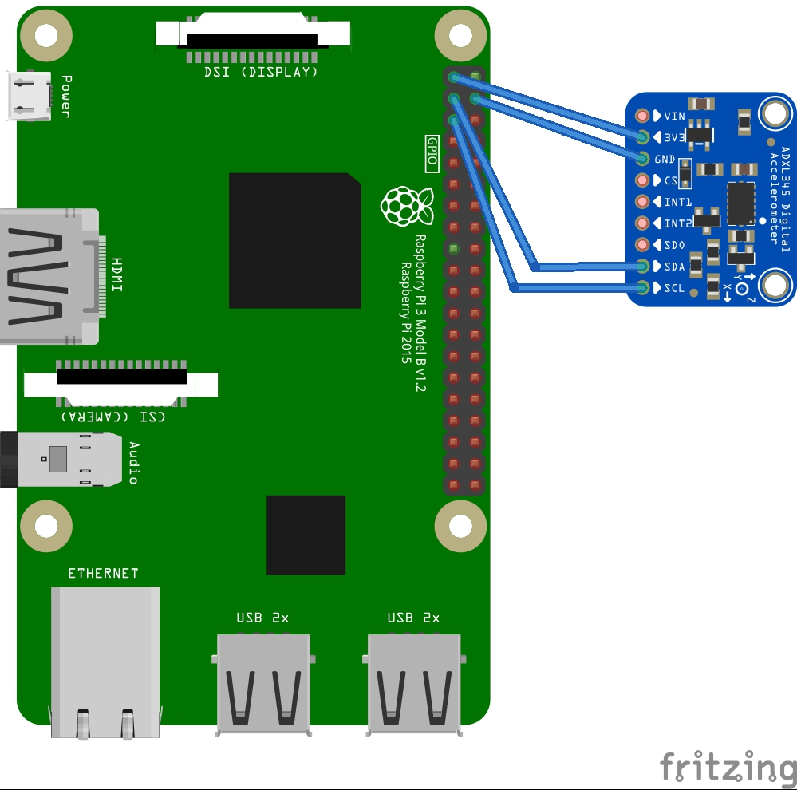

## Description

Get X,Y,Z acceleration from ADXL345 sensor.


## Usage 

1.  Clone the repository
    ```sh
    git clone https://github.com/iotiotdotin/sensor-examples.git
    cd sensor-examples/sensor-code/led_blink
    ```
1.  Connect the sensors according to the connection diagrams given.
    
    
1.  Run the code
    ```sh
    sudo python3 ./accelerometer.py
    ```
