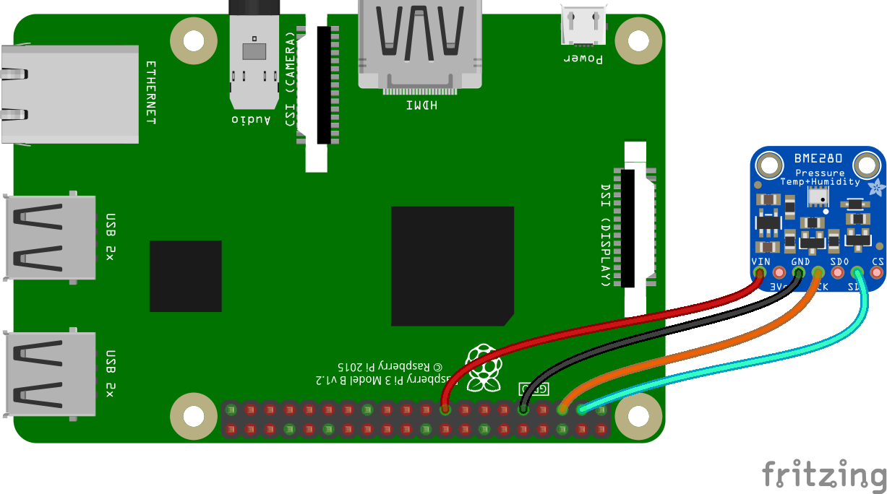

## Description

Read temperature and pressure values from BME280/BMP280 sensor.


## Usage 

1.  Install dependencies on BrainyPi
    ```sh
    sudo apt-get install python3-dev python3-pip python3-smbus i2c-tools -y
    sudo pip3 install RPi.bme280
    ```

1.  Clone the repository
    ```sh
    git clone https://github.com/iotiotdotin/sensor-examples.git
    cd sensor-examples/sensor-code/weather_sensor
    ```
1.  Connect the sensors according to the connection diagrams given.
    
    
1.  Run the code
    ```sh
    sudo python3 ./weather_sensor.py
    ```
